# Bedside - Machine write-up from season 11 HTB

## Nmap

Standard Nmap over the target

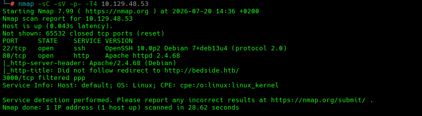

We find a SSH port, a web app and the domain: bedside.htb

This puts the focus of our enumeration over the web app.

## Web app

We land on a page that talks about AI, being that a newly attack surface on many web apps since they are starting to use a lot of AI tooling.

### Vhost Fuzz

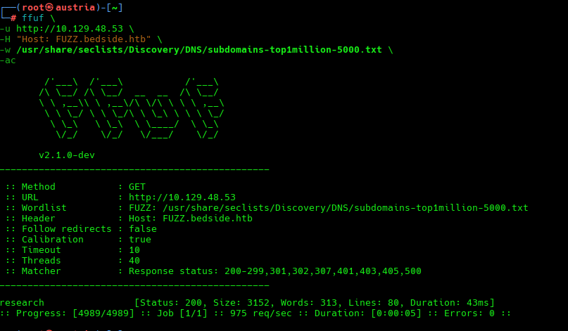

We do some Vhost enumeration to find hidden ones and we hit one.

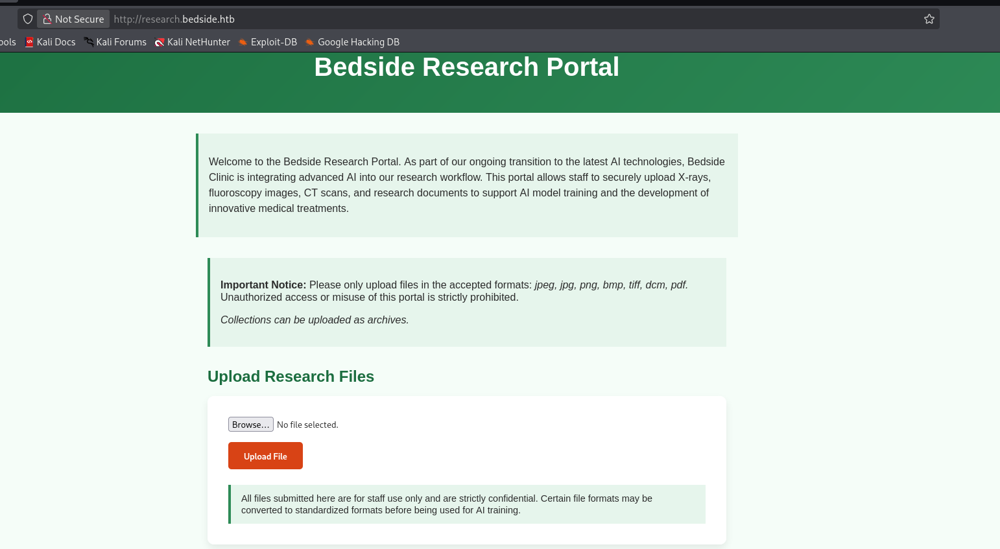

We find here a potential vector through file uploading that will require more investigation.

Website is telling us how not only is a file upload but some backend is gonna process the file.

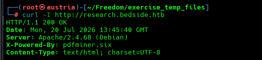

Investigating the found vhost, we see that the headers give us info about pdfminer.six

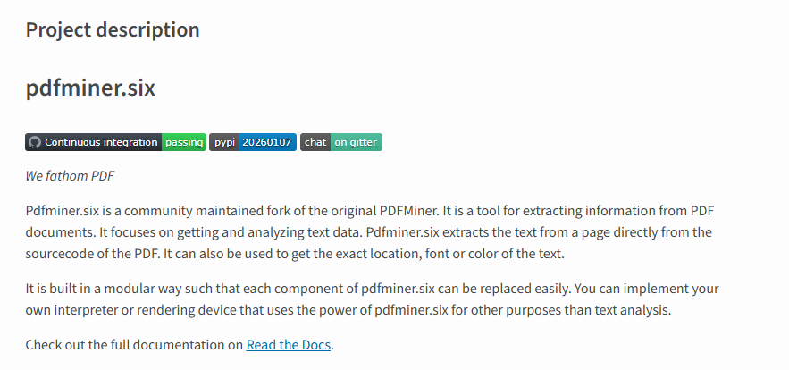

We test the functionality with a test picture.

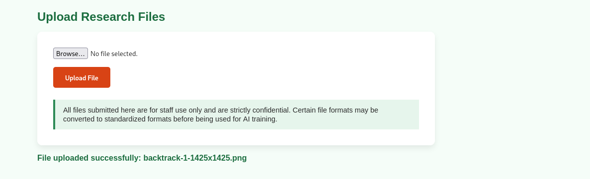

And we test with wrong format

We see how the app is leaking its server-side path

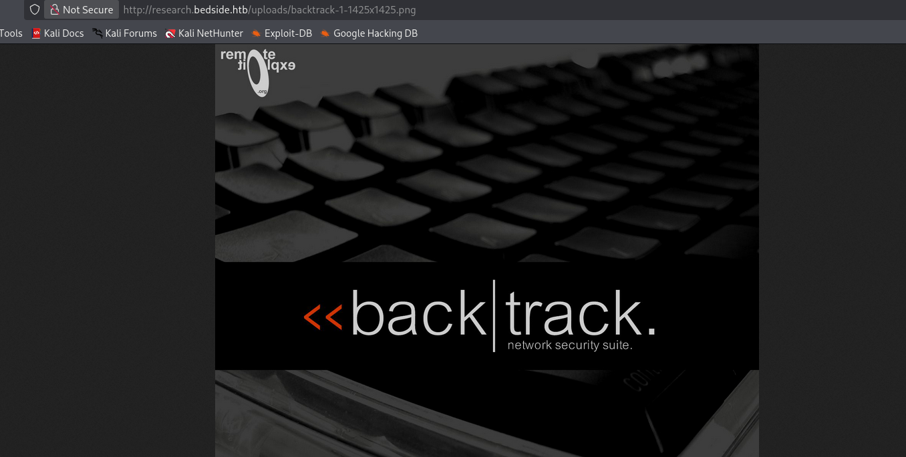

Then we land with out uploaded picture on the directory /uploads/

## Found CVE

After some OSINT investigation around the pdfminer we find a published CVE

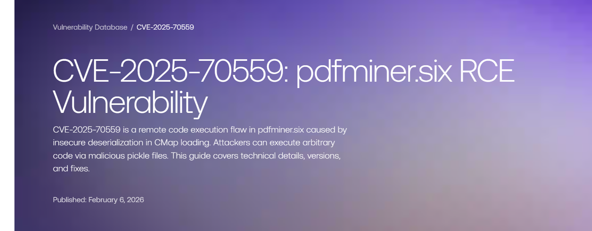

Following instructions we need 2 files

A python file using pickle to desterilize python object, when the pickle module tries to reconstruct a class it looks for the reduce method, this method is HOW to reconstruct it, but we can make that the method literally runs shell commands 

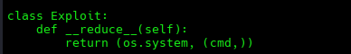
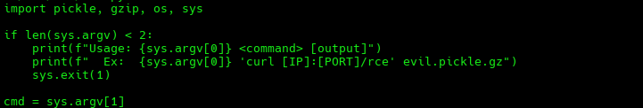

Then we need a PDF file, according to documentation, to trigger this pickle parsing. So pdfminer reads the PDF we craft following some encoding rules to trick pdfminer. Since pdfminer uses pickle we can use it to load our RCE payload.

It is important to know the path where the zip file is stored so we can used the pdf file to target the location and trigger the execution.

## Usage of tool

Making the pickle with the reverse shell
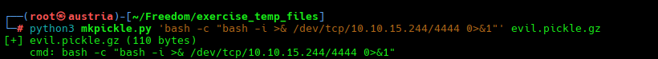

Pdf that triggers the execution of the pickle
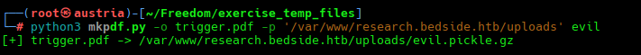

Land shell as datawrangler user
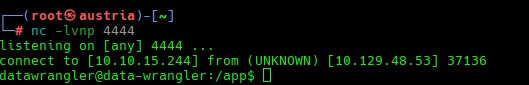

# Enumerating System as DataWrangler

During system enumeration and the mounts we see that we are inside a docker container.

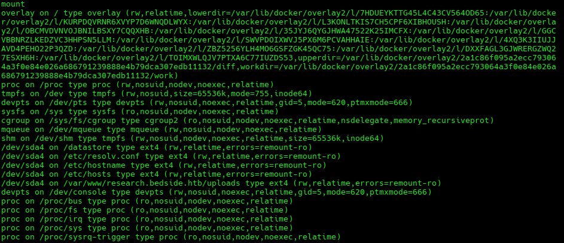

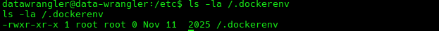

So the focus changes into finding a way to escape the docker container

## Inside Docker

Curious .sh script on tmp directory

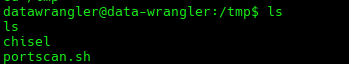

After running it, we see a port 3000 only listening locally

We use chisel to forward the connection

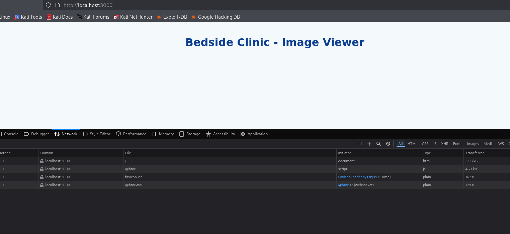

We found an empty web with HMR websocket protocols

Eventually we try path traversal in this newly found internal port

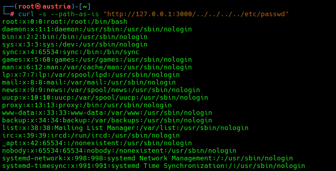

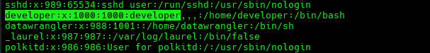

We find the user that potentially has the user flag

Trying path traversal to grab flag over the found user

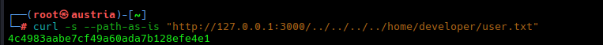

Found USER flag

## Escalation of privileges

After grabbing the user flag, next objective is becoming root. So we keep exploring the system with the path traversal vulnerability we found

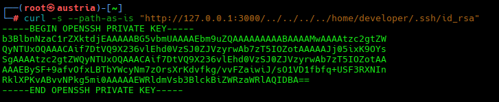

We found the keys to SSH into the target machine as developer, which will help us in our system enumeration

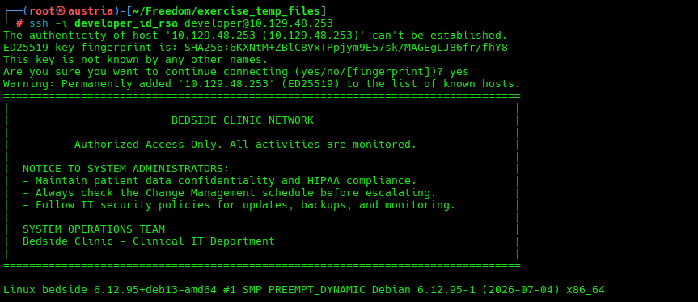

We made the SSH key usable and we SSH into the machine

# Getting Root

Found a script that runs as root without password

Problem is that the script is reading files from a folder that as developer user we have no write perms. We remember that when on datawrangler we could write there.

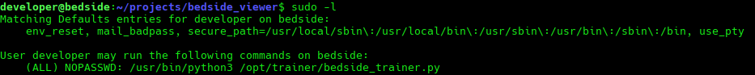

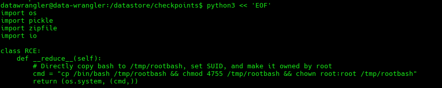

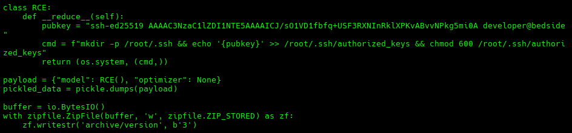

After testing payloads, we find that the best way is to add our developer ssh key and add it for authorized keys for root

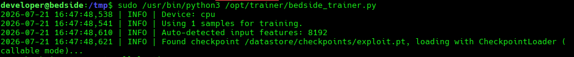

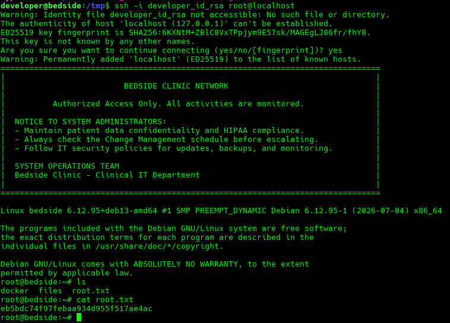

Root and flag.