# NMAP

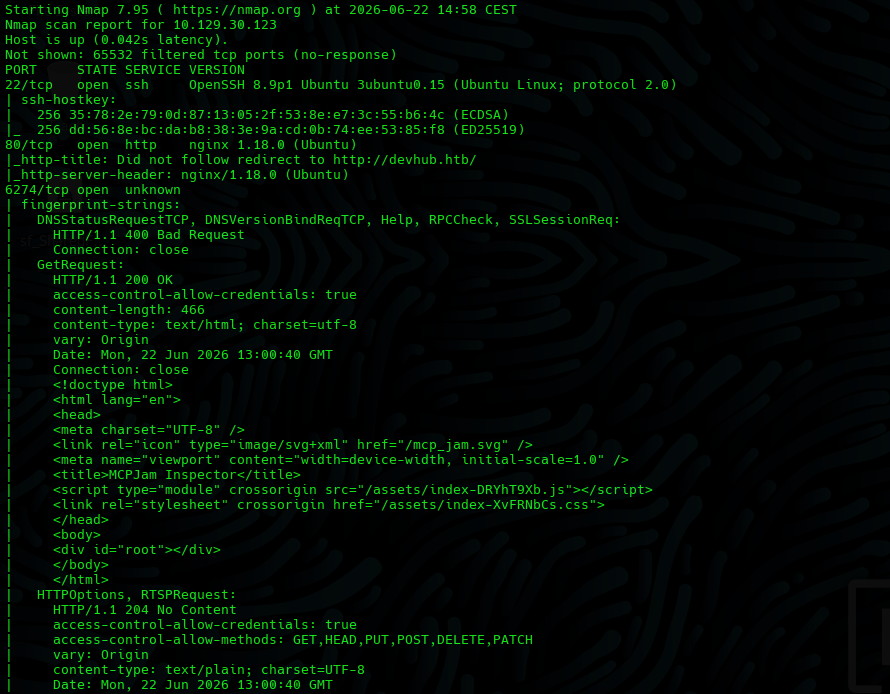

Port `6274`.

We found an MCPJam service running a vulnerable version.

On port `80`:

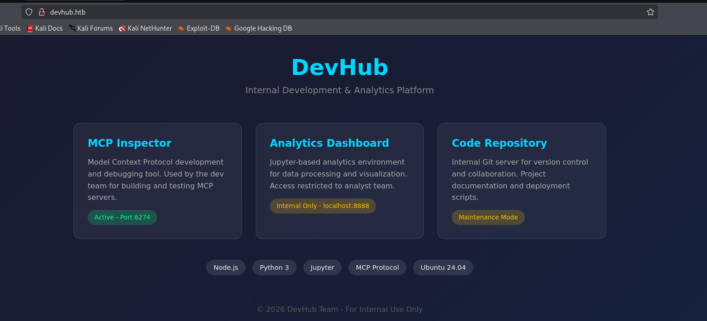

We found a web application with access to internal tooling.

# Running Exploit for CVE-2026-23744

https://github.com/ALRAYZZ/CVE-Exploits/tree/main/exploits/CVE-2026-23744

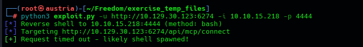

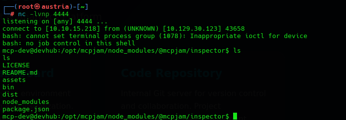

# SSH Persistence Post Exploitation

Before doing any enumeration, we establish stable SSH access by injecting our public key into `mcp-dev`'s `authorized_keys`.

On the attacking machine:

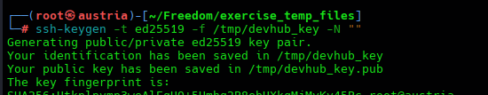

On the reverse shell:

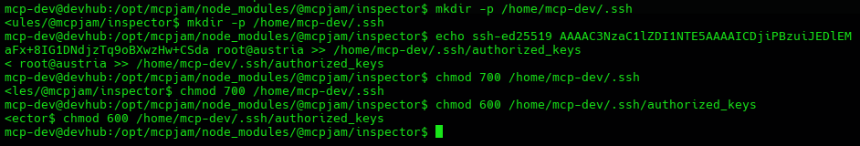

We are creating a new SSH key pair and adding the public key to the target machine, allowing us to SSH back into it as the exploited user, `mcp-dev` in this case.

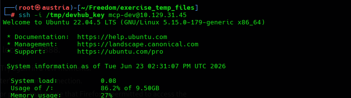

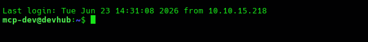

We now have a stable shell.

# Lateral Movement

## SSH Port Forwarding

We establish a **Secure SSH Local Port Forwarding Tunnel** to bypass network restrictions and access hidden internal services.

Jupyter on `localhost:8888` and OPSMCP on `localhost:5000` are not reachable directly from outside the machine. We use SSH local port forwarding to tunnel both services to our attacking machine.

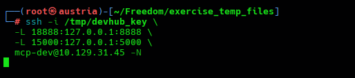

So basically, we make our requests pass through the SSH connection and get forwarded to the target machine, allowing us to access services that are only bound to the target's localhost or otherwise blocked by network restrictions.

# Jupyter

Finding Jupyter on port `8888`:

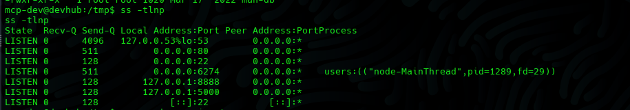

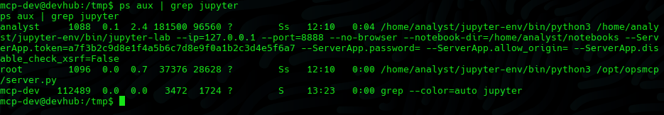

Token:

`a7f3b2c9d8e1f4a5b6c7d8e9f0a1b2c3d4e5f6a7`

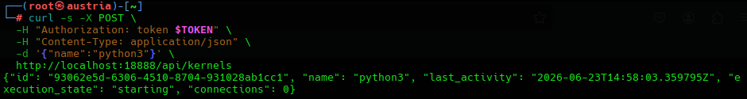

## Executing Code Using the Jupyter WebSocket Protocol

We found online that Jupyter does not execute code through the REST API. The REST API is primarily used for lifecycle and management operations, such as creating and deleting kernels or listing notebooks. Code execution is handled through the **Jupyter Messaging Protocol** over WebSockets, specifically through the `/api/kernels/{kernel_id}/channels` endpoint.

The protocol requires sending a structured JSON message with `msg_type: "execute_request"` on the shell channel. Results are then streamed back as `stream` messages through the IOPub channel.

The key to avoiding a race condition is to associate all message handlers with `parent_header.msg_id`, matching responses specifically to our request. We also trigger completion on `execute_reply`, which arrives after the execution request has been processed, rather than relying on the `idle` status message, which can arrive prematurely.

We used our own tool based on documentation found online:

https://github.com/ALRAYZZ/CVE-Exploits/tree/main/tools/jupyter-remote-exec

This tool allows us to gather the token and kernel ID and pass code for remote execution.

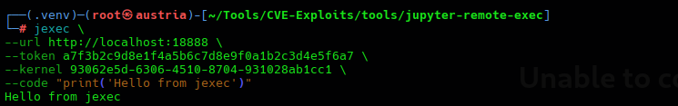

A small example:

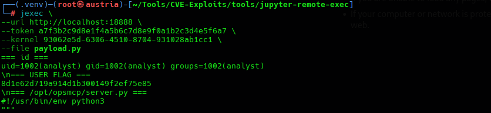

It also allows us to send a script file as the entire payload

# Accessing server.py from OPSMCP

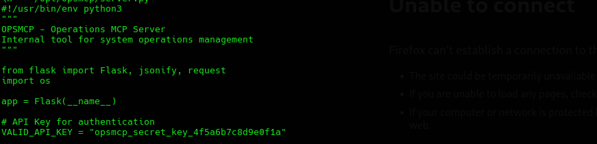

API_KEY = `opsmcp_secret_key_4f5a6b7c8d9e0f1a`

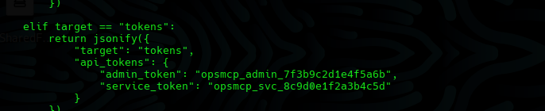

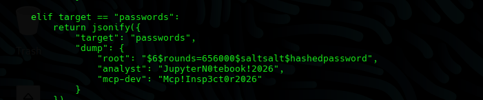

The `ops._admin_dump` tool can read the `id_rsa` SSH private key.

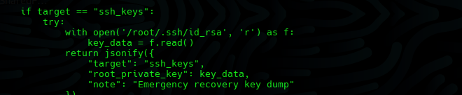

We use this key in our `curl` requests:

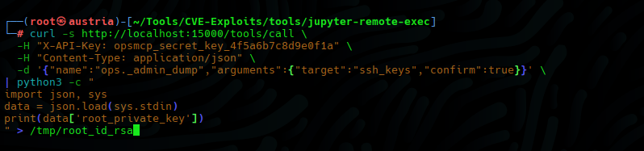

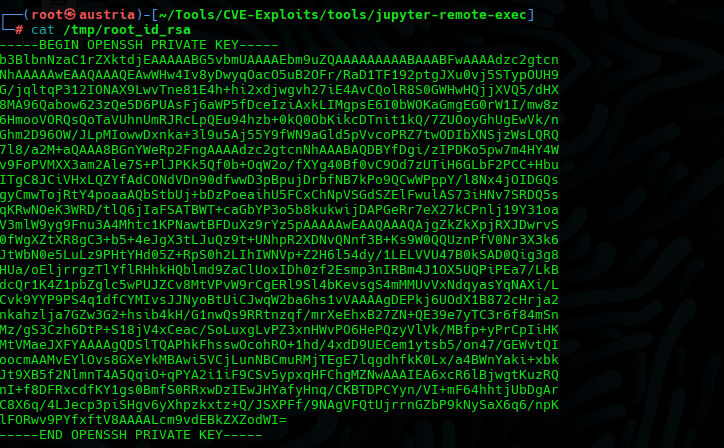

We then change the permissions on the key with `chmod` and use it to log in:

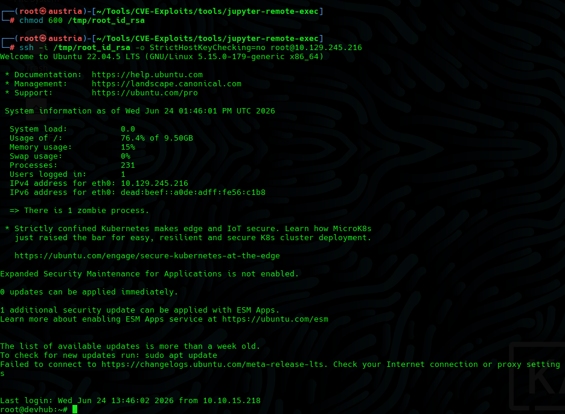

