Footprinting Lab - Easy

# 0. Given Information

This Lab is part of HTB academy and the exercise provided some initial information:

It being that the company name was Inlanefreight Ltd, the security team of the company wanted to to a penetration test, to check the internal DNS server. Client was interested on knowing what kind of information we could extract from it.

Also the client made it clear that it was forbidden to attack the services using exploits.

Finally we were provided some credentials: "ceil:qwer1234"

# 1. Reconnaissance

## Nmap
We started with a basic Nmap scan with version script.

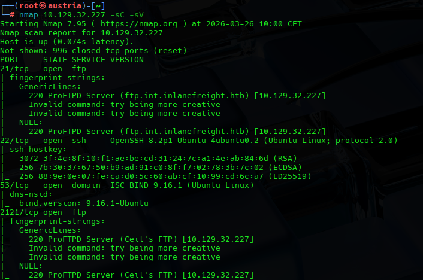

Here we were able to see the 4 ports and services open to us.

Two FTP ports, one SSH and the DNS server.

The FTP service on port 21/TCP also provided a valuable extra information, it being the domain name. Since it was not provided, when trying for DNS footprinting we could not do a proper enumeration without it.

So we extracted that the base domain was inlanefreight.htb

## DNS
After gathering the needed domain for a proper DNS enumeration we proceeded.

### Query Start of Authority (SOA)

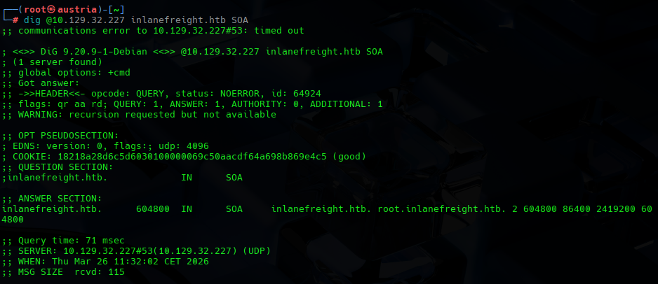

We find that the DNS exists and its authoritative meaning potential enumeration.
Recursion is disabled.

### Query Name Server (NS)

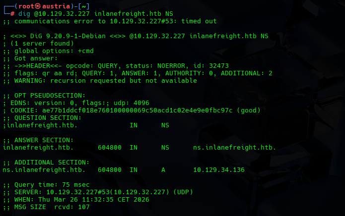

Nameserver was identified with its IP and domain.

The logical next step in the DNS would be to try a Zone Transfer

### DnsEnum Tool
Finally we used dnsenum tool using a wordlist

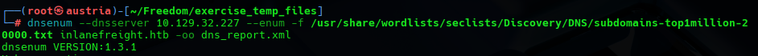

## FTP
Finally we tried to connect and scan the FTP services, since we had two services open, one on the common port 21 TCP and a custom one on 2121 TCP.

For FTP we tried the credentials provided by the exercise introduction notes, and first we try the common port 21

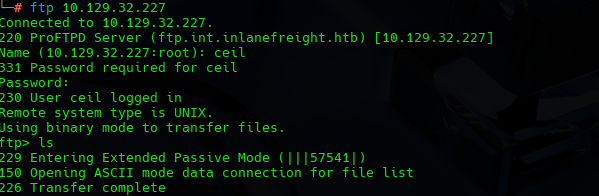

This resulted on a successful login, but an empty directory.

We also tried to list hidden files, but nothing of use was found.

So we tried the other FTP port 2121

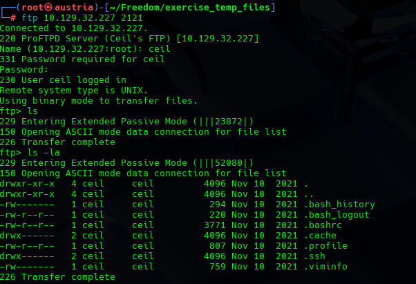

This time we found many directories that we will later analize

# 2. Vulnerability Discovery

## DNS
After the DNS enumeration and discoveries, we proceed and try a Zone transfer.

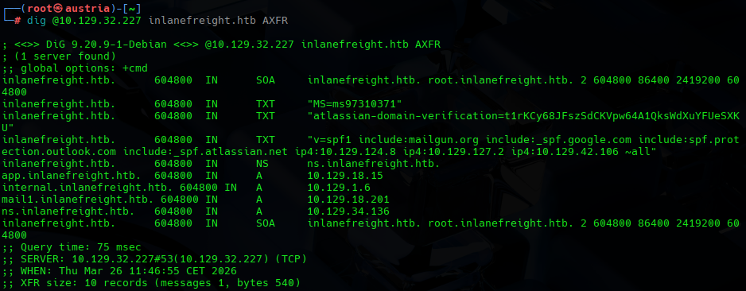

We succesfully are able to do it, extracting valuable information about the company tools and sub domains.

We found tools like Mailgun(mailgun.org), Google Workspace(_spf.google.com) or Gmail, Microsoft365(spf.protection.outlook.com), Atalassian - Jira or Confluence(_spf.atalassian.net) and different mails server IPs 

As an extra we tried some CHAOS queries on the server, that allowed us to retrieve the hostname.

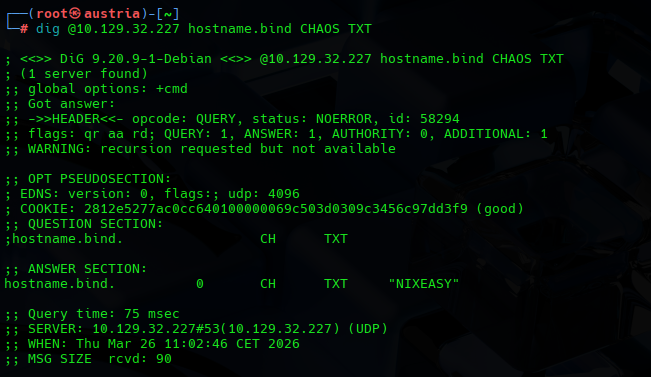

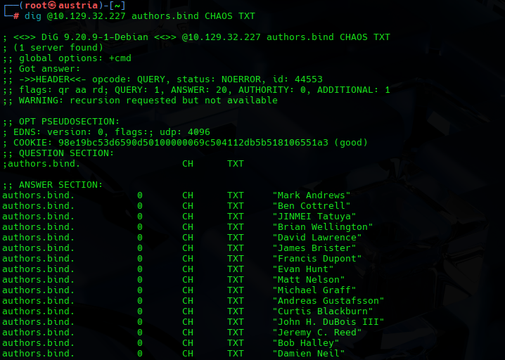

## FTP
With the enumeration we did on the service we found dangerous exposed directories like .bash_histroy and the .ssh directroy, which usually holds SSH keys.

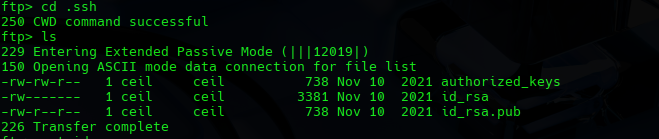

As expected .ssh directory contained the keys and bash history gave some clues on the flag location.

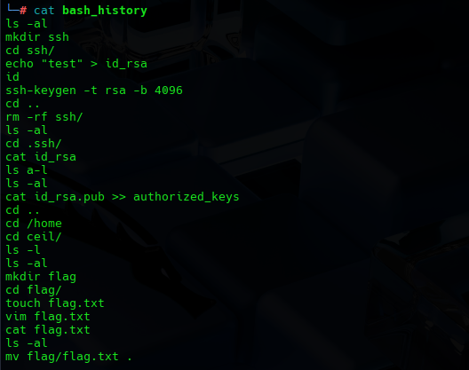

# 3. Exploitation and Post Exploitation

The most obvious path was to use those SSH credentials on the SSH service we found on port 22/TCP and see if that would give us access. Using the username provided.

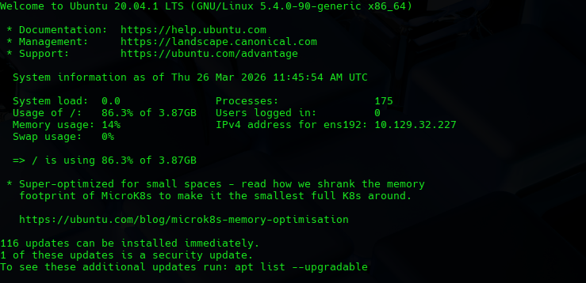

It gave us access to the ceil account on the target server.

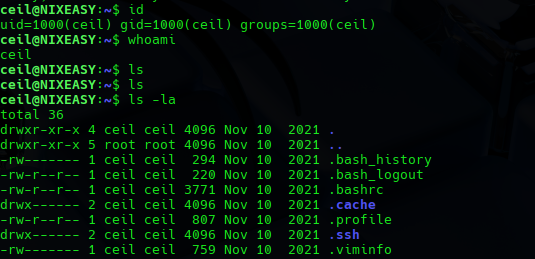

Finally, and with the help of the bash_history we found the flag.

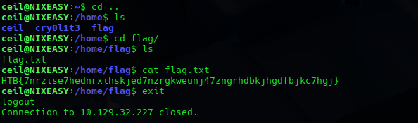

# 4. Remediation

Key lessons are:
- The public credentials exposed by the exercise
- DNS server accepting CHAOS queries and Zone Transfers
- Remove sensitive actions in bash_histroy
