# 1. Reconnaissance

## Nmap

Starting with a basic Nmap scan to see what services are active and listenting on target.

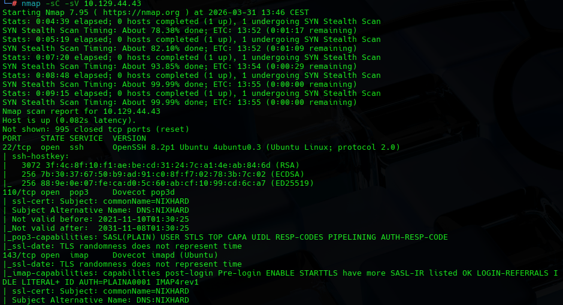

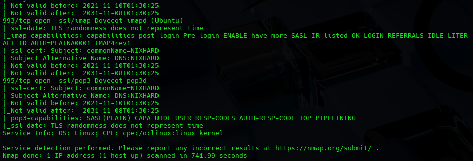

From it we can see the main services running:

- SSH -> Remote access to system
- POP3 -> Used by mail clients to download mails from a mail server
- IMAP -> Accessing and managing emails directly on server
- IMAPS -> IMAP over SSL/TLS
- POP3S -> POP3 over SSL/TLS

We can assess this target machine is a mail server with remote administration enabled.

Also as important we found the hostname

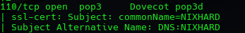

Usually a Mail Exchange will need SNMP service running on some port, even if its hidden to our previous scan or running in UDP

And so doing a UDP scan we found new ports

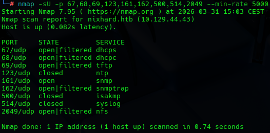

## SNMP

Thinking SNMP could be a good spot to get some data we enumerate it further

We try different wordlists to find a community string for the SNMP

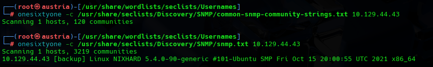

Which we eventually do find.

Then we use that string to get more information about the system

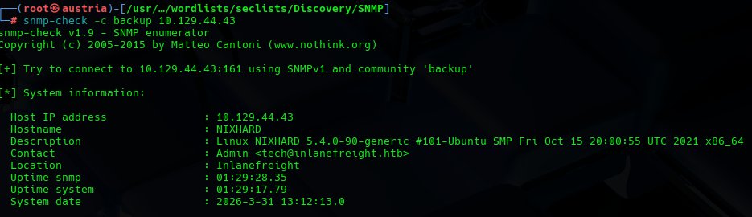

# 2. Vulnerability Discovery

## SNMP

Following the previous snmp-check result, this time we decide to dive deeper and use snmpwalk

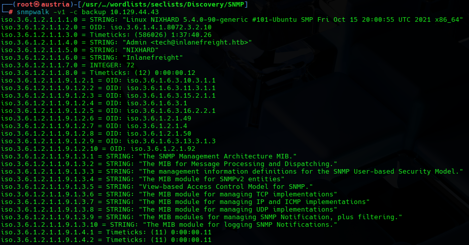

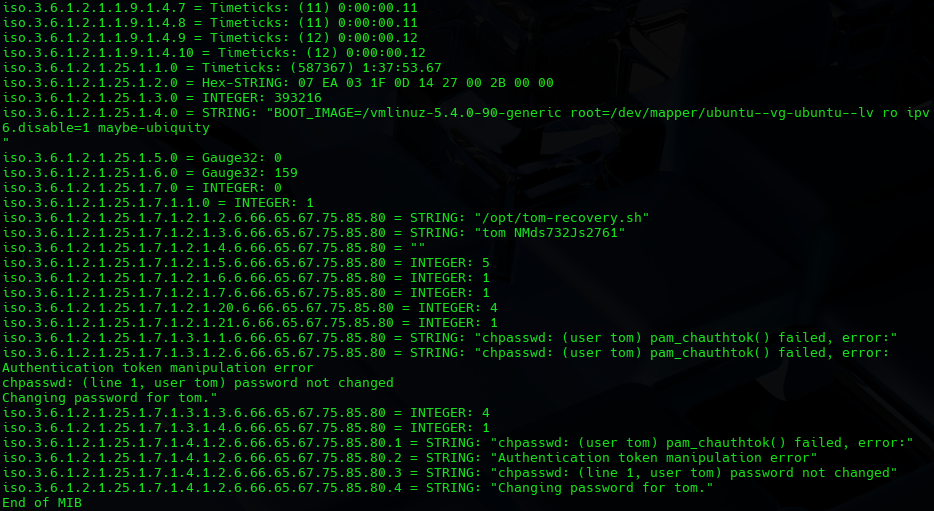

We discover an important data leak of credentials and some sort of credentials recovery bash script.

Finally we test this credentials in SSH but we get rejected, and then with the mail service pop3

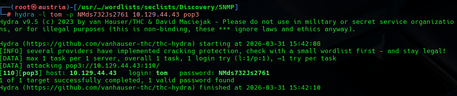

We get a confirmation from the hydra tool that the credentials are working so we procceed with an actual connection using netcat

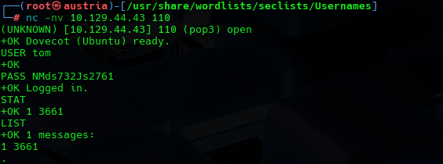

We get in the mail account and we see that we have 1 message.

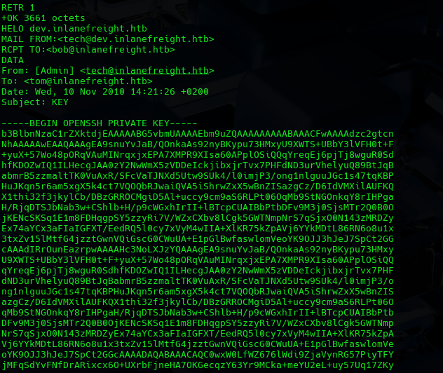

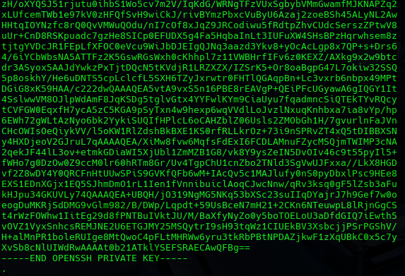

We hit an important SSH private key

# 3. Exploitation and Post Exploitation

After getting the SSH key, we make our own local id_rsa file containing that key so we can use it with an ssh command.

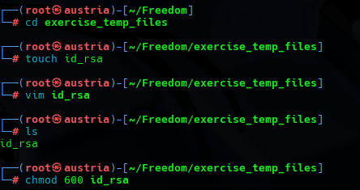

Then we use it on SSH

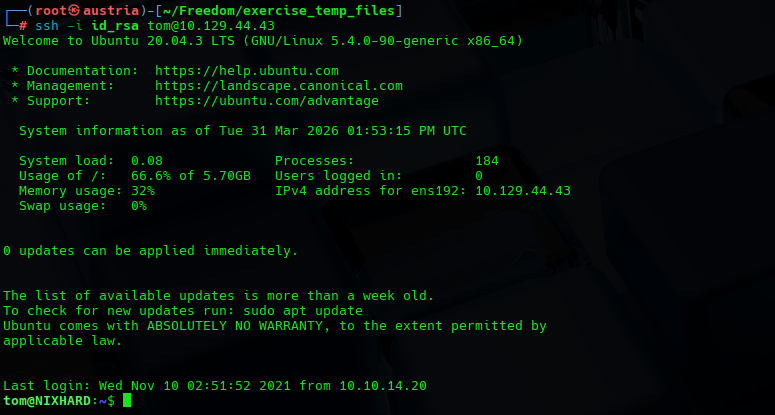

And we gain access to the target host as tom user.

Once inside, we try to find out how that script worked and see if we could do something with it.

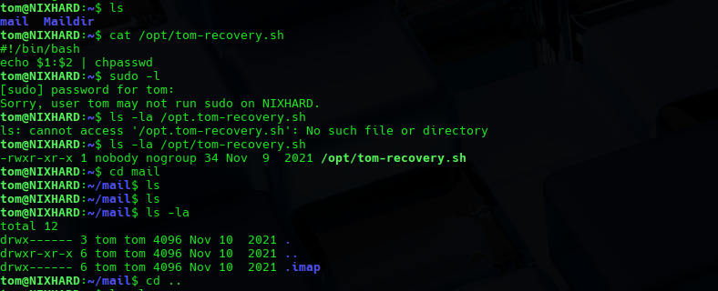

We faced a dead end so we kept enumerating directories

And we found a mysql command history, so we explore it to see what database the host has access to and what contents, tables might have

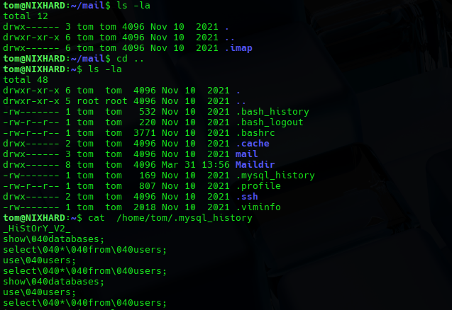

From the commands we can see that there is a users database and tom has access to it, so we try the connection.

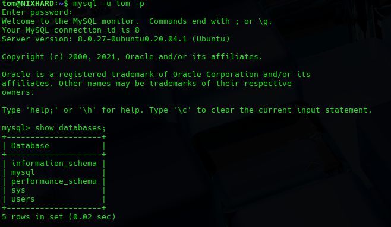

Trying tom credentials get us in and we start exploring the database tables.

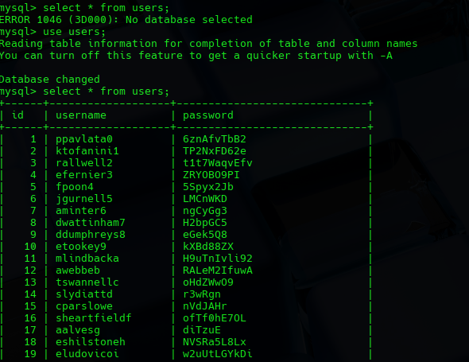

We find the users table w ith plain text passwords.

And finally our user flag

# 4. Remediation

Issues and vulnerabilities found:

- SNMP configuration using a predictable 'backup' community string and an insecure version of SNMP v1 that sends data in clear text. SNMP should be upgraded to v3 that supports encryption and strong authentication.

- Data in MIBs, system was configured to log process arguments and script outputs in the SNMP walk.

- Sending unencrypted SSH private keys over internal mail service (POP3/IMAP) and password reusing.

- Disable SQL command history, or add clean up scripts.

