# 1. Reconnaissance

## Nmap

Starting with a basic Nmap scan

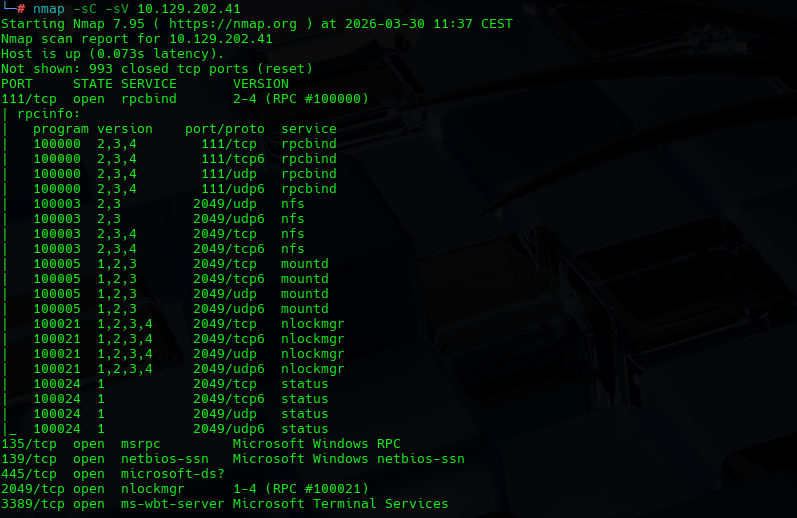

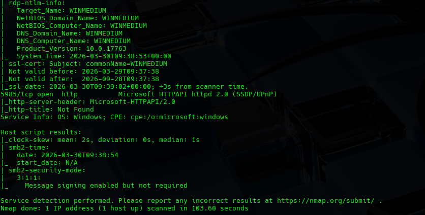

We found many services with open ports:

Port 111 - rpcbind

Port 2049 - nfs/nlockmgr - Sharing files using NFS

Port 135 - msrpc - Microsoft Remote Procedure Call

Port 139 and 445 - NetBIOS and SMB - File, printer sharing

Port 3389 - ms-wbt-server - Remote Desktop Protocol, graphical login.

Port 5985 - http - Windows Remote Management WinRM - remote shell.

#

Based on this scan we can come up with a strategy of order based on the priority since some services are more robust and might require credentials.

NFS/SMB - Potential open doors

RPC - Gather information

RDP/WinRM - If info/password log in

## NFS

We start with NFS because many times the shares are accessible to anyone on then network.

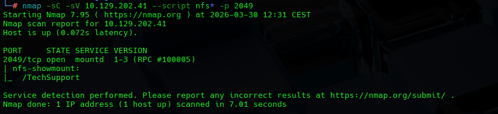

We can see in both scanns a TechSupport mount.

## RPC & SMB

We see how the service is operating as we use RPC but we found a login

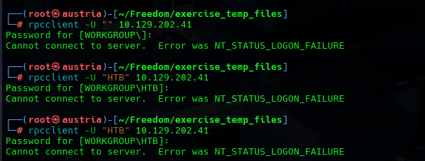

Also tried Samba Share Enumerator tool

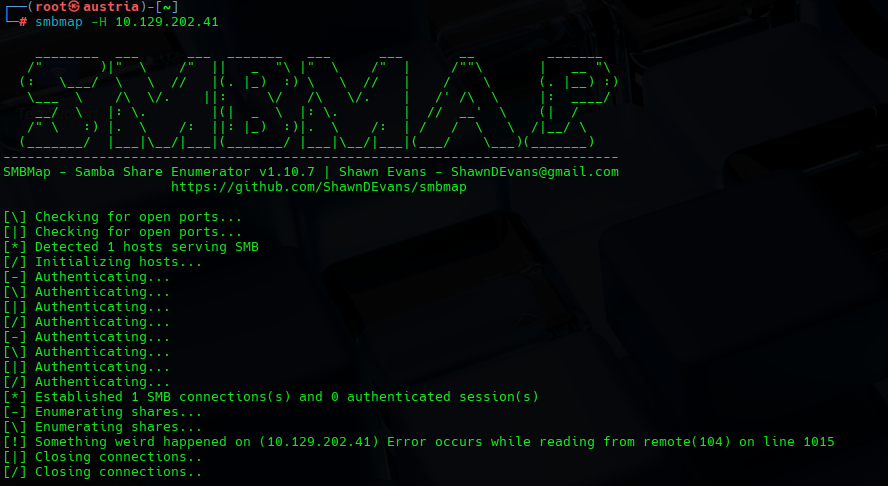

And some manual SMB client connections

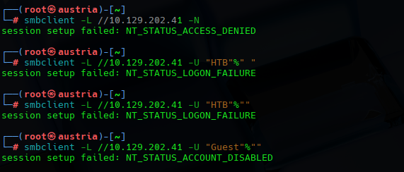

# 2. Vulnerability Discovery

## NFS

After discovering thhe public share, we mount it locally to investigate it

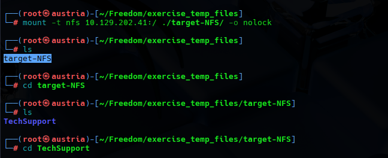

And found a batch of tickets.txt

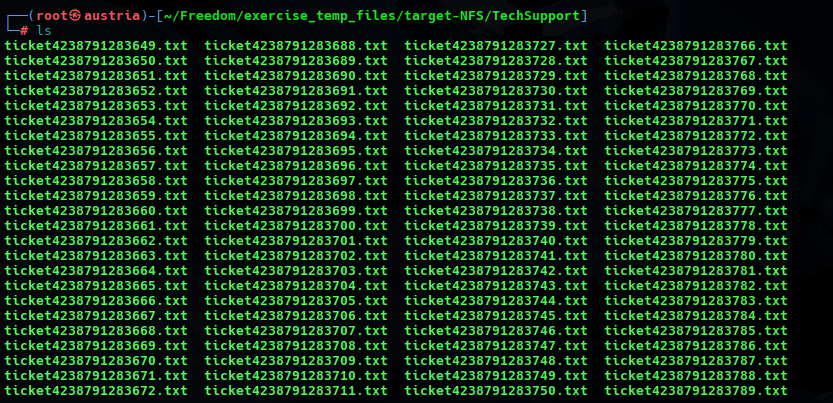

Investigating a bit more the tickets we run:

To see if we get any match, and we do.

# 3. Exploitation and Post Exploitation

After finding a ticket.txt that exposed some password we try to read it all to get more context

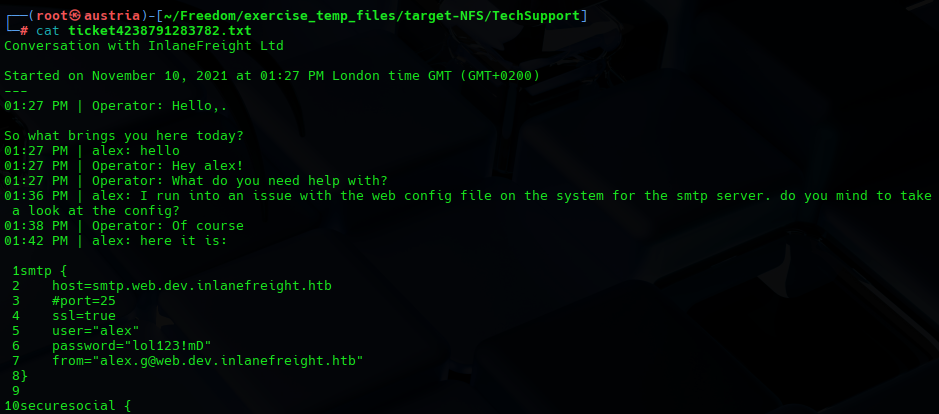

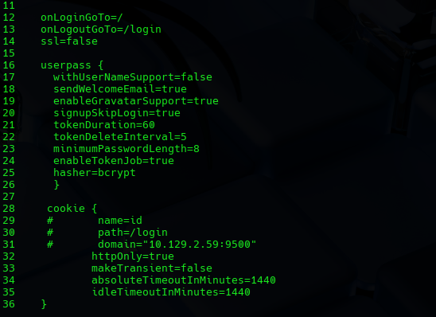

We found many data about a user "alex" like mail and credentials

This gives us access to the RPC service

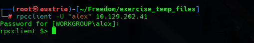

Trying the found credentials on smbclient:

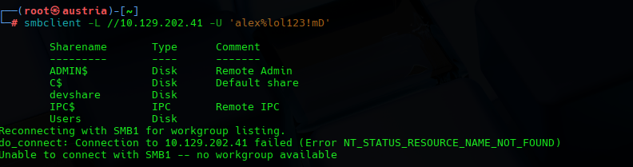

We find the admin shares

We manage to get inside the directories and we start exploring finding:

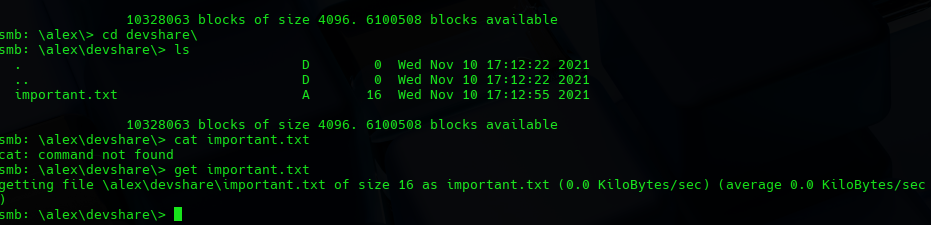

an "important.txt" file

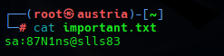

sa usually stands for System Administrator and is the default account for Microsoft SQL Server (MSSQL).

We confirm it

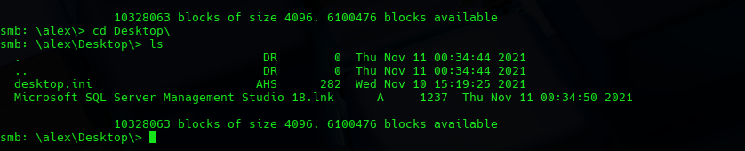

Using WinRM service and the credentials

We get full access as administartor to the target machine

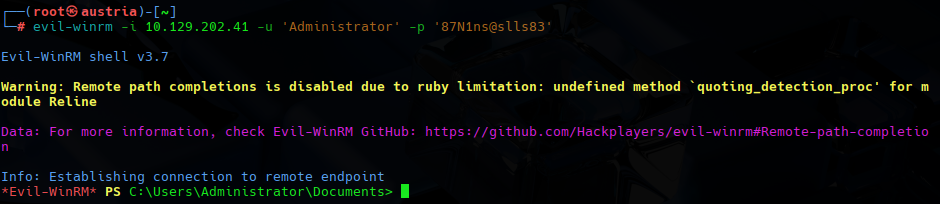

With the credentials found we also try to access the SQL server that we check that is running on local machine since we could not find user "HTB" on system.

We run a check on running services

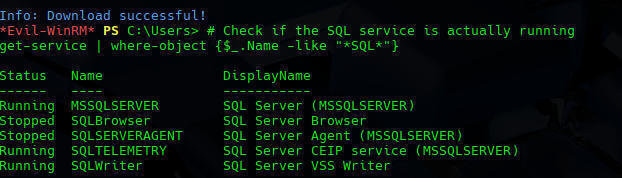

Then we run the sql commands to enumerate the directories

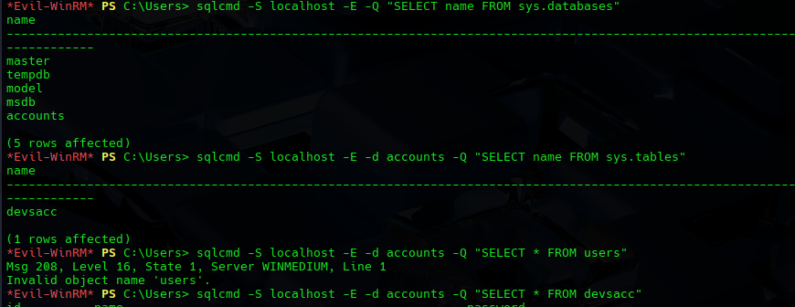

and find our flag

# 4. Remediation

Key lessons:

- Secure Network File Shares: The entry point was a public TechSupport share that exposed credentials from a user.

- The escalation was posible because with the credentials found on ticket.txt we could access the files and directories shared in network. Allowing us to find a devshare with System Administrator credentials in plain text.

- Also service, specially critical ones, should not share passwords.

- The Database access was closed to the network but accesible locally with higher privileges.

- We should encrypt passwords in data bases also. Never save passwords as plain text.

