# 1. Reconnaissance

We are given an IP address, so we start our recon with Nmap

## Nmap

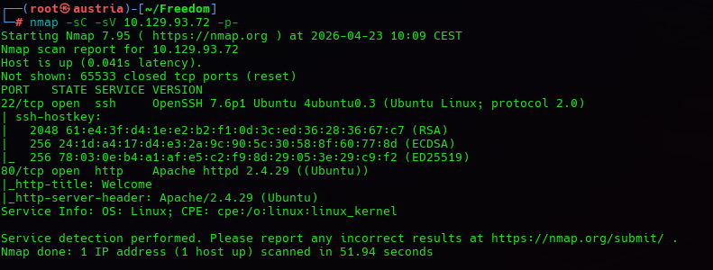

In this scan we can see the SSH service and a website

Landing page:

After checking the website we realize that the buttons and different labels have no use and no other directories can be found.

So two ideas came to my mind, to try fuzzing and inspecting source code for some clues.

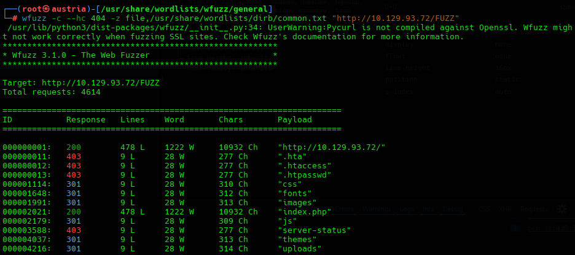

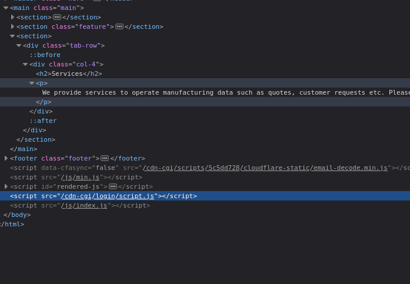

An interesting directory that gives us the idea of possible vulnerabilities is the /uploads one, hinting a possible file upload capabilities.

Also the source code exposes a potential log in portal under /cdn-cgi/

We found the login portal

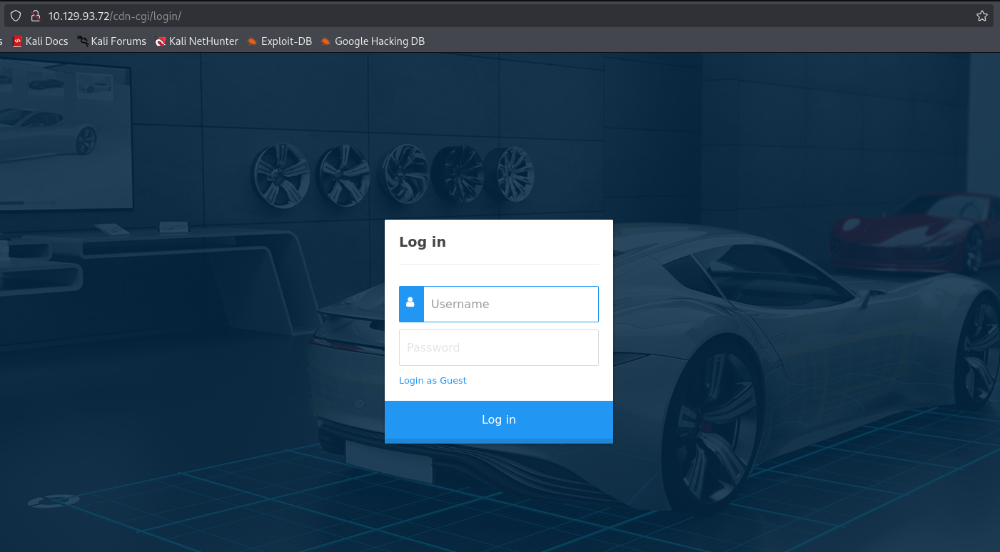

We see there is a Login as Guest option

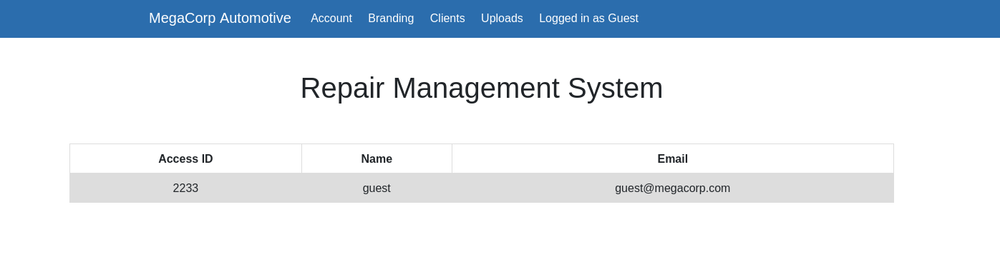

# 2. Vulnerability Discovery

Website allows cookie tampering by changing name and value of the user logged in

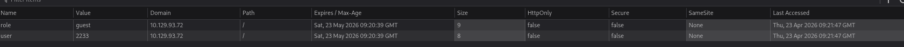

At this step, even if we know we can tamper the cookie, we need extra clues on what to try, we can brute-force and try many options, but another string to pull appeared on the URL

I realize that this Guest page has the id=2, so i tried a basic URL manipulation

# 3. Exploitation and Post Exploitation

Changing the id=2 for id=1

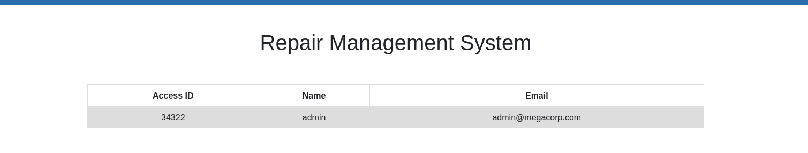

We found a new page, this time with the admin ID and name, hinting me to try these new values into the cookie.

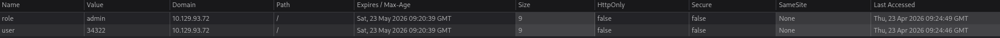

We manage to get access to the admin only upload system

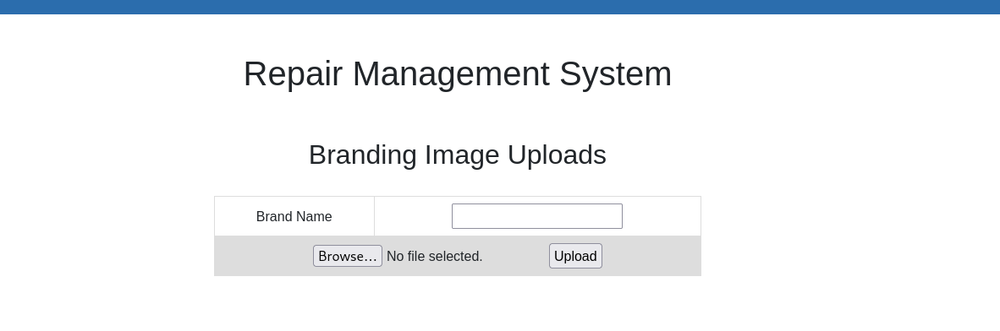

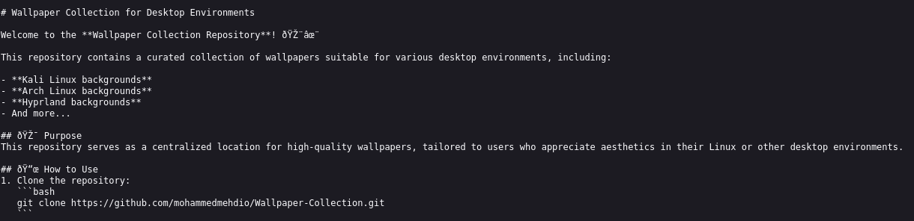

Trying the first /uploads directory from the fuzzing, with the name of the file uploaded strongly suggested the possibility of RCE on the target with an adequate .php file.

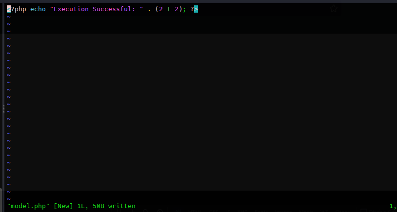

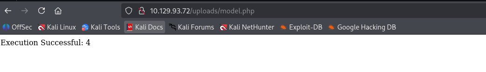

Successful RCE

At this point I could use the basic "system(_GET)..." to pass shell commands using the URL, but making it stateless mades the target enumeration way slower and tedious, so I opted for a reverse shell.

Started to listen on 4444

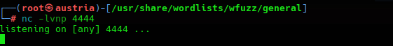

PHP code calling for a TCP connection into my IP

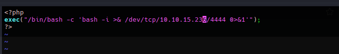

We upload the file and call it with an HTTP request

Success with the www-data user.

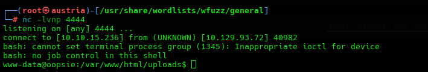

At this point we have a lower prio access on the target machine, so our focus shifts to privilege escalation

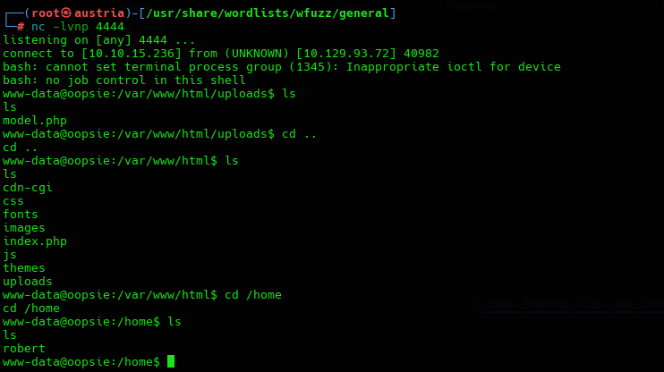

Also, by just searching through unprotected files we managed to find a flag for the user robert

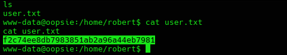

## Privilege Escalation

While we keep searching we stumble onto another valuable information while listing hidden files

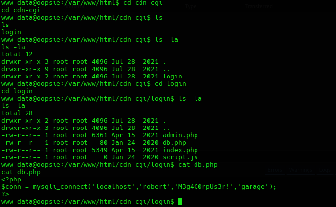

We found some credentials for mysql, so we check for credentials reusage.

Using this new creds, we try to switch to a more privileged user "robert"

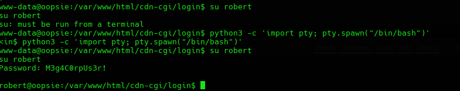

We first have to spawn a proper terminal so the target allows us to switch user calling "su"

And we manage to get inside robert's user

But 'robert' is not the root of the machine, so our work is not finished

It is common for many websites to run common bug trackers like MantisBT, Jira, Bugzilla and they can be source of sensitive information

So in one of those checks using the tool find inside the target machine

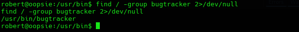

We found a directory of potential interest

Using a known vulnerability from SUID and bugtracker, we know that bugtracker calls for cat in an insecure manner doing something like:

`system("cat /root/reports/bug_report.txt");`

This means, it relies on the PATH variable to find where cat is

So we can modify and create a fake cat executable that does what we want

First we create the logic of what the new 'cat' will do, spawn root shell.

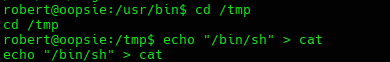

We make it an executable and set it on the PATH variable so it gets found before the actual cat tool.

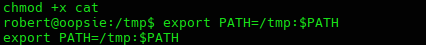

We run the actual bugtracker program that we know is gonna call for 'cat' but in this case is gonna call for our new 'cat' tool

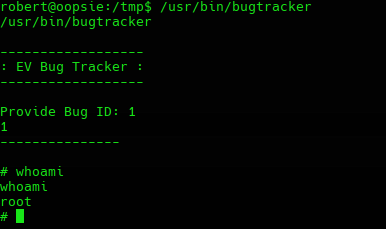

We make a random input to trigger the logic and we spawn a root shell

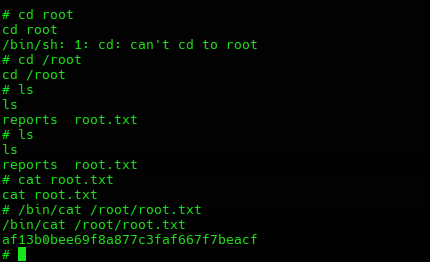

Now, all it is left is searching for the root directories to find the flag

# 4. Remediations

- Big Vulnerability the fact that with an URL manipulation we could access an admin information

- Cookie tampering allowed

- File uploading system letting us execute .php code

- Plain text credentials

- Known Bugtracker vulnerability under (CWE-426: Untrusted Search Path or CWE-427: Uncontrolled Search Path Element.)

The application uses partial path for the cat tool, making it exploitable with newly created cat tools.

