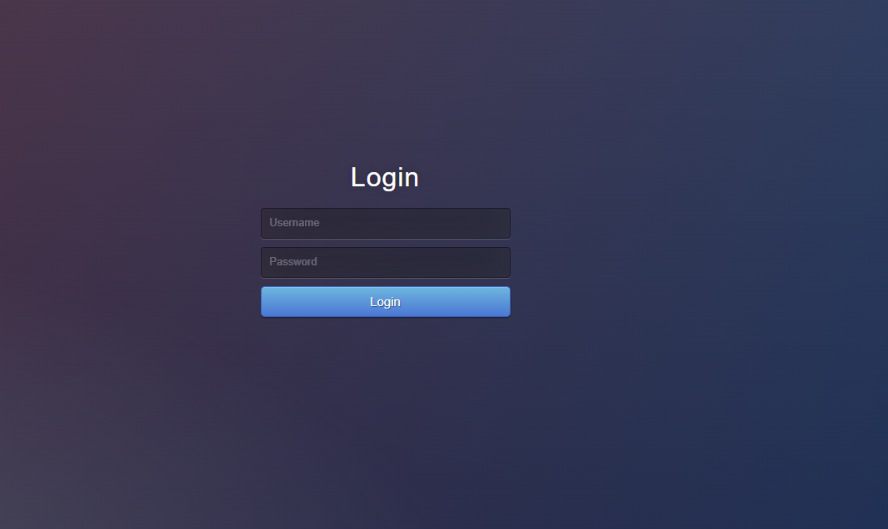
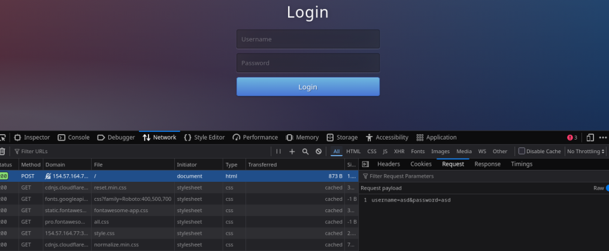
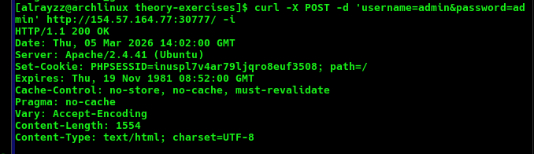
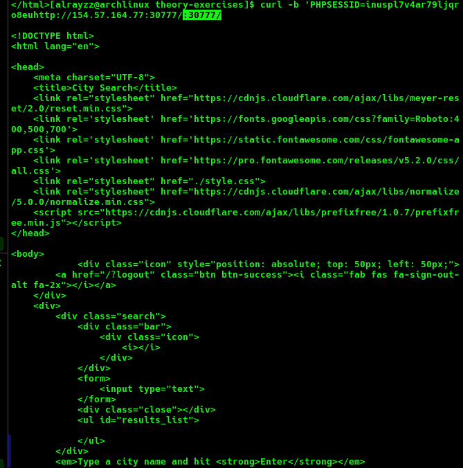
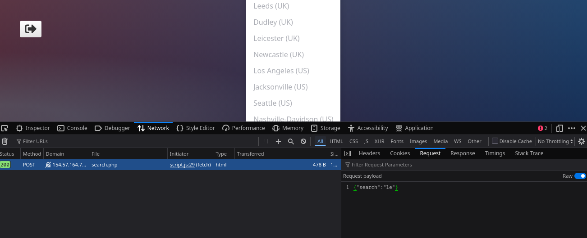
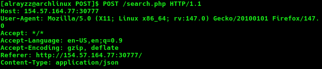
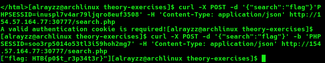

The objective of this theoretical exercise was to access a web app server with a provided IP and a provided login credentials, and work with the cURL functionality and the extraction of the cookie header after a succesful login to use in the cURL tool to search for the flag through a JSON POST request to /search.php after finding it being a call from the main web app to achieve the search functionality.

What we found when we used a browser to reach the ip provided

Testing random inputs to understand the POST request payload format

Then using this required cURL flags to use the provided credentials with the right format as we inspected in the web browser and we can see we get a cookie

With the cookie we can use the cURL tool again to see if we get access to the contents of the site behind the login without needing to input the credentials

Now we land on a search functionality after entering credentials

Inspecting what request gets sent when searching we see that is using a .php page
and we can see the Json format used for the post request

We can confirm its Json format by copying the request from the dev tools and pasting it

Finally we combine and craft a full cURL command that will perform the appropiate POST request, with the correct json format, and we will look for the 'flag' using our acquired cookie

